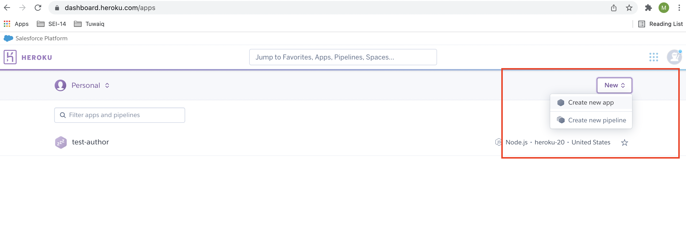
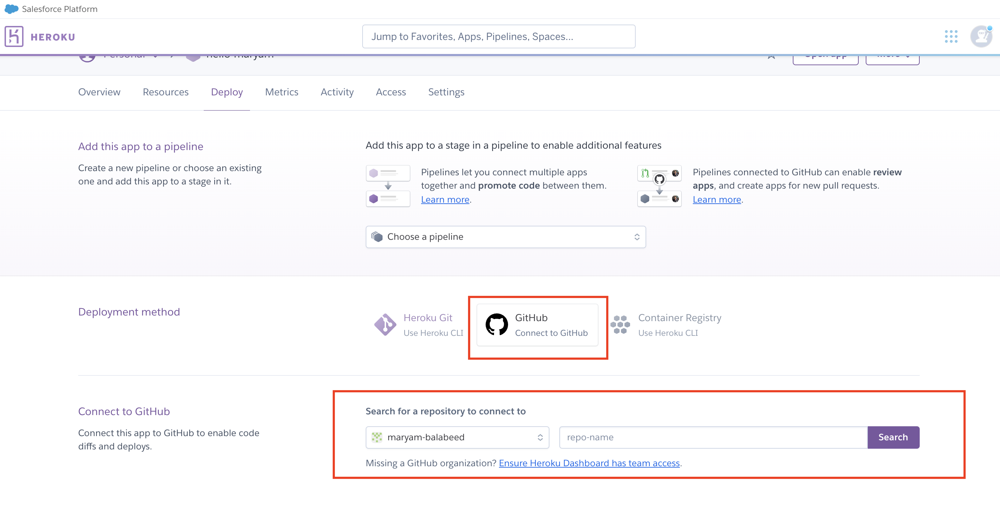
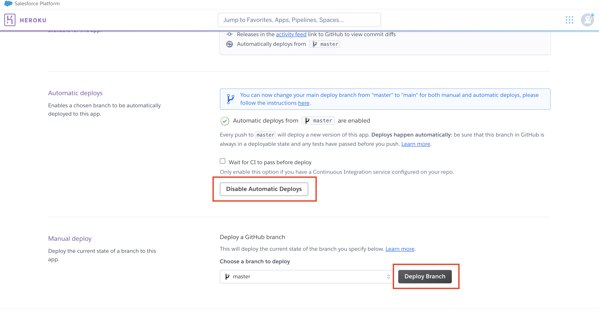

# Heroku_Deployment


Deployment 

- Add to the app.js the following: 
```
const path = require("path");
```
```
app.use('/', express.static(path.join(__dirname, '/frontend/build')));

app.get("*", (req, res) => {
  res.sendFile(path.resolve(__dirname, "frontend/build/index.html"));
});

const PORT = process.env.PORT || 3001;
app.listen(PORT);
```


- Add to package json backend in the script: 
```
    "dev": "npx nodemon app.js",
    "test": "echo \"Error: no test specified\" && exit 1",
    "build": "cd frontend && npm run build",
    "install-client": "cd frontend && npm install",
    "heroku-postbuild": "NPM_CONFIG_PRODUCTION=false npm run install-client && npm run build",
    "client": "cd frontend && npm start",
    "start": "node app.js"
```

- Go the frontend folder and run this command 
`npm run build`  
- Heroku install  https://devcenter.heroku.com/articles/heroku-cli 
- From the command run `heroku login`
- Go to heroku create new app 



- Connect to your GitHub repo



- Deploy 


